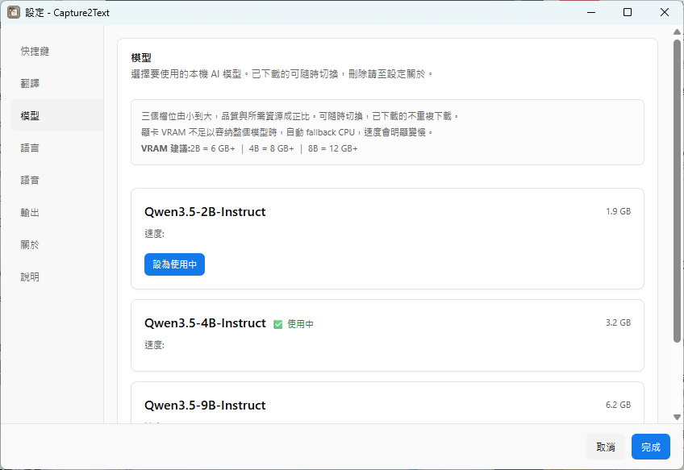
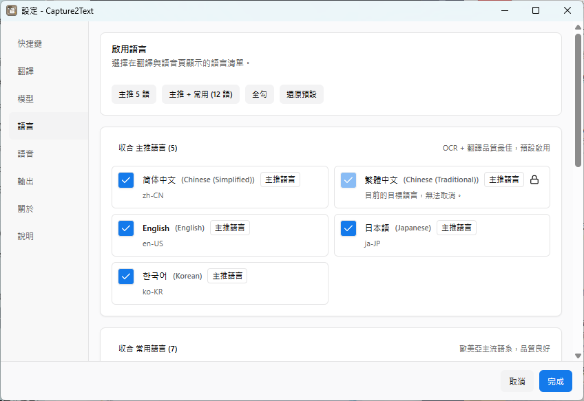
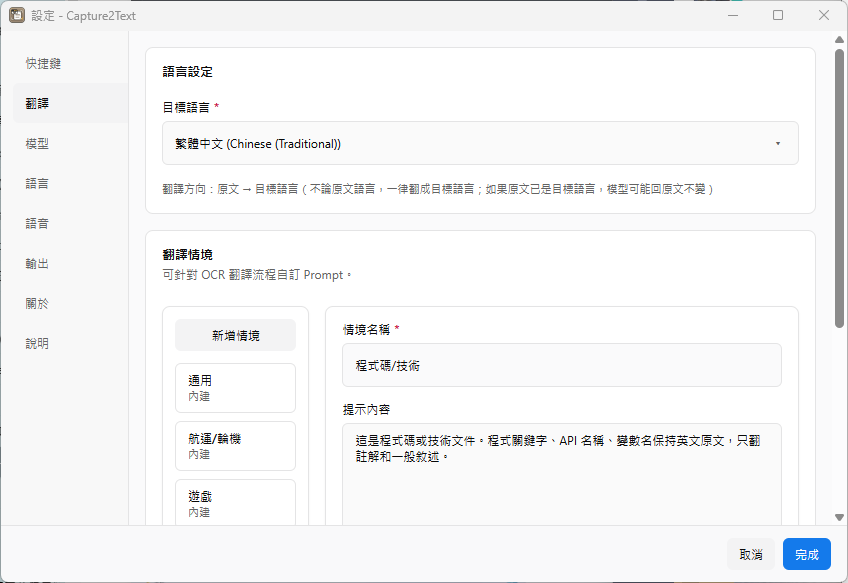
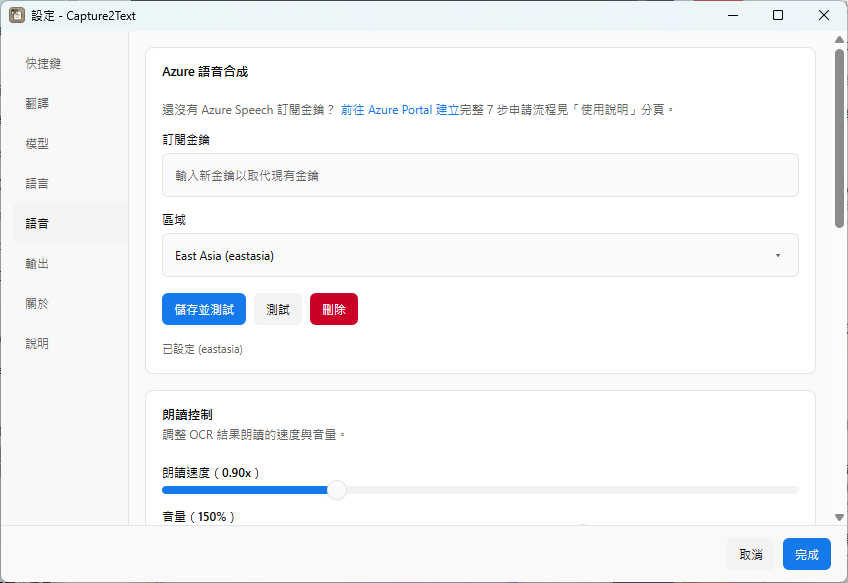
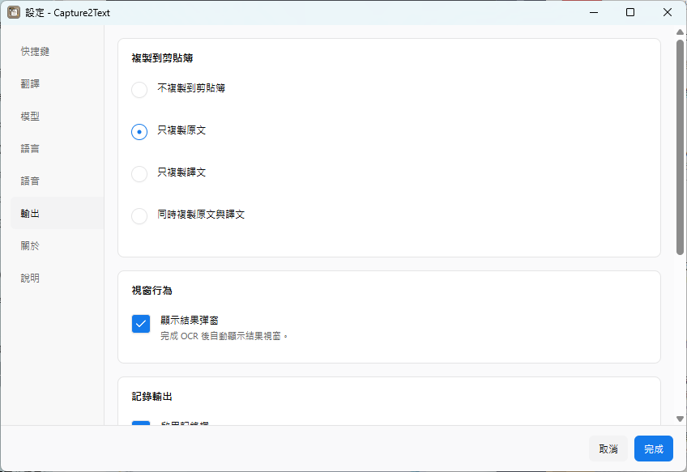
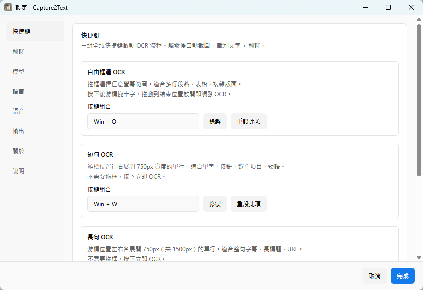

# Capture2Text Pro

> Windows 桌面 OCR + 智慧雙向翻譯 + Azure TTS 朗讀 — 全程本地 VLM，離線可用。

按 **Win+Q** 框選螢幕任意區塊，本地視覺語言模型（VLM）一次完成「辨識 + 語言偵測 + 正確方向翻譯」，結果視窗即時串流顯示，可一鍵複製或用 Azure 神經語音朗讀。

從 Christopher Brochtrup 的 [C++ 版 Capture2Text](https://capture2text.sourceforge.net/) 衍生（原版已停止維護），用 Tauri 2 + Rust 重寫。OCR 引擎從 Tesseract 換成本地 VLM（llama.cpp + Qwen3.5），單次 pass 同時做 OCR 與情境化翻譯。

## 為什麼做這個

學語言時，翻譯品質常常因為「沒上下文」卡關 — 同樣一句話在遊戲、技術文件、醫療場景應該翻得不一樣。這支程式針對**學習者**設計：

- **智慧雙向翻譯**：抓母語內容 → 翻成目標語言（練習方向）；抓其他語言 → 翻成母語（看懂方向）。一個熱鍵涵蓋兩種學習場景。
- **針對情境調翻譯**：看遊戲就用遊戲社群術語、讀程式碼就保留專有名詞、看醫療文件就走台灣醫學會慣用詞。
- **聽 AI 自然語音念法**：Azure TTS 神經語音模擬母語者腔調，輔助發音 / 聽力學習，快速建立語感。

## 功能總覽

| 熱鍵 | 模式 | 行為 |
|---|---|---|
| **Win+Q** | 自由框選 | 拖框選擇任意螢幕範圍，適合多行段落、表格、複雜版面 |
| **Win+W** | 短句 | 游標位置往右展開 750px 的單行，適合單字、按鈕、選單項目 |
| **Win+E** | 長句 | 游標左右各展開 750px（共 1500px）的單行，適合整句字幕、長標題、URL |

三組熱鍵皆可在「設定 → 快捷鍵」重新錄製。觸發後自動截圖 + 辨識 + 翻譯，一氣呵成。

- **智慧雙向翻譯（單次 pass）**：模型一次完成 OCR + 語言偵測 + 正確方向翻譯，不會「先翻錯方向再切回來」
- **三檔模型可選（app 內下載切換）**：Qwen3.5 2B / 4B / 9B，速度與語言覆蓋自己挑
- **20 語支援（分三級品質）**：「設定 → 語言」自選啟用範圍
- **本地 VLM（離線）**：llama.cpp 驅動，模型與推論全在本機，不上傳任何畫面
- **即時反饋**：框選當下結果視窗立即出現（辨識中動畫），模型冷啟動顯示「模型啟動中」
- **自動復原**：背景 watchdog 監控推論引擎，crash 自動重啟 + 重試，不用手動救
- **Azure TTS BYOK**（可選，F0 免費 tier 一般夠用）：語速 / 音量滑桿、試聽即時停止
- **結果視窗**：複製、朗讀、編輯後再朗讀
- **剪貼簿輸出**：可設定自動複製原文 / 譯文 / 兩者（含分隔符選擇）
- **同熱鍵連按會中斷正跑的 OCR**，只跑最後一次
- **Tray 系統選單即時同步**：改設定後 tray 自動更新，不用重啟
- 熱鍵自訂

## 介面截圖

**模型管理** — 三檔 Qwen3.5 內建下載器，一鍵切換，附 VRAM 建議：



**語言啟用** — 20 語三級分級，快速預設一鍵勾選：



**翻譯設定** — 目標語言 + 翻譯情境（內建 5 個，可自訂 prompt）：



**語音（Azure TTS）** — BYOK 金鑰管理 + 朗讀速度 / 音量滑桿：



**輸出** — OCR 完成後自動複製原文 / 譯文到剪貼簿：



**快捷鍵** — 三組熱鍵皆可重新錄製：



## 模型三檔位

「設定 → 模型」內建下載器（含進度條），下載完即可切換，不用手動找 GGUF：

| 模型 | 下載大小 | 建議 VRAM | 支援語言 | GPU 速度（RTX 4070 Ti 實測） | CPU 速度 |
|---|---|---|---|---|---|
| **Qwen3.5-2B** | ~1.9 GB | 6 GB+ | 8 語：中（繁/簡）、英、日、韓、法、德、西 | 0.3–0.8 秒/張 | ~24 秒 |
| **Qwen3.5-4B** | ~3.2 GB | 8 GB+ | 14 語（上面 + 葡、義、俄、印尼、土、波蘭） | 0.5–1.5 秒/張 | ~47 秒 |
| **Qwen3.5-9B** | ~6.2 GB | 12 GB+ | 全 20 語（上面 + 越、阿、泰、印地、希、希伯來） | 1–3 秒/張 | 60–100 秒 |

VRAM 不足以容納整個模型時自動 fallback CPU（速度明顯變慢）。

- 2B 是輕量檔位，速度最快；4B 是速度/品質甜蜜點；9B 品質最佳、小字小圖最穩
- 模型皆為 GGUF Q4_K_M 量化，跑在內建 llama.cpp（llama-server，port 11500）

## 20 語與品質分級

支援的語言依 OCR + 翻譯 + TTS 的綜合品質分三級：

| 等級 | 數量 | 涵蓋語言 | 說明 |
|---|---|---|---|
| **主推語言** | 5 | zh-CN、zh-TW、en-US、ja-JP、ko-KR | 品質最佳，預設啟用 |
| **常用語言** | 7 | fr、de、es、pt、it、ru、vi | 歐美亞主流語系，品質良好 |
| **進階語言** | 8 | ar、id、th、hi、el、he、tr、pl | 含 RTL 或特殊字元，可運作但建議測試；TTS 走英文 fallback 音色 |

「設定 → 語言」勾選要啟用的語言；「設定 → 翻譯」選母語 + 目標語言（必須在啟用清單內）。注意各模型檔位的語言覆蓋不同（見上表）— 想用進階語言請選 9B。

## 智慧對翻邏輯

設定 `母語 = zh-TW`、`目標 = en-US` 時：

| 框到的內容 | 翻成 | 用途 |
|---|---|---|
| 中文（=母語） | 英文（=目標） | 練習目標語言 |
| 英文（=目標） | 中文（=母語） | 看懂內容 |
| 其他語言（西班牙文、德文等） | 中文（=母語） | 看懂內容（read mode） |

決策塞進 prompt，模型一次完成 OCR + 偵測 + 正確方向翻譯，UI streaming 從一開始就是正確語言，沒有過場閃爍。

也提供**直接翻譯模式**（設定 → 翻譯 / tray 選單切換）：不論原文是什麼語言，永遠翻成目標語言。

## 情境（針對學習場景的翻譯模式）

每個情境是一段 prompt，告訴 VLM 「請用這種風格翻譯」。內建 5 個情境：

| 情境 | 用途 |
|---|---|
| **通用** | 預設，中性翻譯助理 |
| **航運 / 輪機** | 商船貨櫃船，保留 M/E、TEU、B/L、reefer、bunker 等英文專業縮寫並加中文註解 |
| **遊戲** | 遊戲社群慣用譯法，保留專有名詞（角色名 / 裝備 / 技能） |
| **程式碼 / 技術** | 保留 API 名 / 變數名 / 程式關鍵字，只譯註解和一般敘述 |
| **醫療** | 台灣醫學會慣用術語，不確定的英文加括號中文試譯 |

**也可以自訂情境**：設定 → 翻譯 tab → 「新增情境」，寫一段 prompt 告訴 VLM 你要的翻譯風格（例：「翻譯成 Z 世代年輕人用語」、「保留動漫專有名詞」、「商業合約風格，謹慎正式」）。每次 OCR 用「使用中」的情境跑。

## 系統需求

**這支程式用 VLM 做 OCR + 翻譯，吃硬體比傳統 OCR（Tesseract / PaddleOCR）兇，先說清楚。** 好處是三檔模型可選 — 機器弱就用 2B，機器強就上 9B。

基本門檻：

- **OS**：Windows 10 / 11（x64）
- **RAM**：16 GB 起跳（模型常駐記憶體 + 系統 + browser）
- **硬碟**：依模型 2–7 GB
- **GPU**：NVIDIA / AMD / Intel 都可，純 CPU 也能跑（慢很多），llama.cpp 自動選；VRAM ≥ 8 GB 時 vision 部分自動 offload 到 GPU

### 建議搭配

| 你的機器 | 建議模型 | 體感 |
|---|---|---|
| 無獨顯 / 內顯筆電 | 2B | CPU 推論 ~24 秒/張，堪用但不快 |
| 中階獨顯（RTX 3060 / 4060，8 GB VRAM） | 4B | 1–2 秒/張 |
| 高階獨顯（RTX 4070 Ti+，12 GB VRAM） | 9B | 1–3 秒/張，品質最佳 |

模型在程式啟動時載入並常駐（熱鍵響應只等推論時間），代價是幾 GB 記憶體一直佔住。在意省電 / 省記憶體的人不適合這支程式。

## 安裝

從 [Releases](../../releases) 抓 `Capture2Text Pro_*_x64-setup.exe` 雙擊裝。

> **若安裝時跳「從伺服器傳回一個轉介」（ERROR_REFERRAL_RETURNED）**：
> 你的機器有 UAC policy `ValidateAdminCodeSignatures = 1`（強迫所有提權的 EXE 必須有 Authenticode 簽章；通常是企業安全軟體留下的設定），未簽章的 installer 被擋。以系統管理員開 PowerShell 跑：
> ```powershell
> reg add "HKLM\SOFTWARE\Microsoft\Windows\CurrentVersion\Policies\System" /v ValidateAdminCodeSignatures /t REG_DWORD /d 0 /f
> ```
> 恢復 Microsoft 預設值即可（不會降低安全，Defender + UAC + SmartScreen 仍正常運作）。

## 使用

裝完啟動，右下角 tray icon 按右鍵 → 「設定」。

1. **模型** — 挑一個檔位下載（建議先 4B），下載完按「啟用」
2. **語言** — 勾選要啟用的語言（預設啟用主推 5 語）
3. **翻譯** — 選母語 + 目標語言；選翻譯模式（智慧對翻 / 直接翻譯）；選情境或自建
4. **語音** — 貼 Azure Speech key + region（可跳過，只用 OCR + 翻譯）；指定每個語言的音色；調整朗讀速度與音量
5. **輸出** — 設定 OCR 完成後是否自動複製到剪貼簿（原文 / 譯文 / 兩者）
6. **快捷鍵** — 改熱鍵（預設 Win+Q / W / E）

設好就 Win+Q 開始用。

## 卸載

uninstaller 提供三種模式，**預設選最保守的「僅刪除程式」**：

| 模式 | 行為 | 適用場景 |
|---|---|---|
| **僅刪除程式**（預設） | 移除程式檔、捷徑、登錄機碼、Edge WebView2 殘留 cache。**保留**設定、OCR 紀錄、下載的 AI 模型 | 想之後重裝、保留設定與資料 |
| **部分刪除** | 下一頁可勾選要清的項目（從本機實際裝過的內容讀出：模型 / OCR captures / 設定 / TTS 快取等）| 想清掉幾 GB 的模型但保留設定 |
| **完全刪除** | `%APPDATA%\com.capture2text.pro\` + `%LOCALAPPDATA%\com.capture2text.pro\` 全部刪除，含 Windows Credential Manager 內的 Azure TTS key | 想徹底還原成未安裝狀態 |

從 **設定 → 應用程式 → Capture2Text Pro → 解除安裝** 進入。

「部分刪除」清單會在 runtime 從 app 自己維護的 `inventory.json` 讀取，未來下載新模型或新增資料類別會自動出現在清單裡。

> **完全刪除模式仍可能殘留**：若 `WebView2 (msedgewebview2.exe)` 卸載時還在背景跑，少量 `EBWebView/` cache 可能 lock 住無法刪。手動清 `%LOCALAPPDATA%\com.capture2text.pro\` 即可。

## 開發

```bash
git clone https://github.com/3134q108-del/capture2text-pro-rs
cd capture2text-pro-rs
npm install
npm run tauri dev
```

需要 Rust（MSVC toolchain）、Node 18+、Visual Studio Build Tools。

打包：

```bash
npm run tauri build           # release
npm run tauri build -- --debug # debug（編譯較快，適合測 installer）
```

產出在 `src-tauri/target/{release,debug}/bundle/nsis/`。只產 NSIS installer（v0.5.0 起移除 MSI）；NSIS 才能掛三模式 uninstaller 自訂頁面。

實作細節見 `docs/capture-spec.md`（Q/W/E 行為移植自 upstream C++ 版）。版本沿革見 [CHANGELOG.md](CHANGELOG.md)。

## 已知限制

- 只在 Windows 測過，macOS / Linux 跑不起來（全域熱鍵和 tray 部分用 Win32 API）
- 純 CPU 推論慢（2B ~24 秒 / 4B ~47 秒 / 9B 60+ 秒），有獨顯才有「秒級」體驗
- Azure TTS 要自備 key，F0 免費 tier 每月 50 萬字符
- Installer 沒簽名，第一次裝會看到 SmartScreen 警告，點「仍要執行」；如機器有 `ValidateAdminCodeSignatures=1`（見「安裝」段）需先關閉
- ⚠️ **截圖範圍太小會 OCR 失準**：用 2B / 4B 時，若截圖**小於 3 個中文字**（約 80×40 像素以下）vision tower spatial detail 不足，模型容易 hallucinate（編造與圖片無關的常見路牌字眼）
  - **建議**：框選時多帶一點空白 / 多框幾個字一起抓
  - **或切到 9B**（設定 → 模型）— 對小圖較 robust，但推論較慢、吃資源多

## 致謝

- [Capture2Text](https://capture2text.sourceforge.net/) — Christopher Brochtrup 的原版，Q/W/E 互動延用此版本
- [llama.cpp](https://github.com/ggerganov/llama.cpp) — Georgi Gerganov 等
- [Qwen3.5](https://huggingface.co/Qwen) — 阿里通義千問

## License

Apache License 2.0（`LICENSE`）。
